#### catalog

1. Neural Networks and Deep Learning
2. Improving Deep Neural Networks: Hyperparameter tuning, Regularization and Optimization
3. Structuring your Machine Learning project
4. Convolutional Neural Networks
5. Natural Language Processing: Building sequence models

## 1. Neural Networks and Deep Learning

### 1.1 What's neural networks

p.s. predict the price of house by size of house.

Use linear function to make a **ReLU(Rectified Linear Unit)** function which will fit this every (size,price) point.

每一个neuron都是一个ReLU函数，通过size计算出对应的price，需要注意的是，由于正常的一条直线会导致price变成负数，所以ReLU其实会是一个从0开始的弯曲的线条。

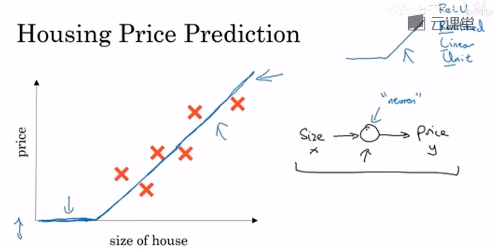

大一些的神经网络其实就是把多个单独的neuron组合起来。

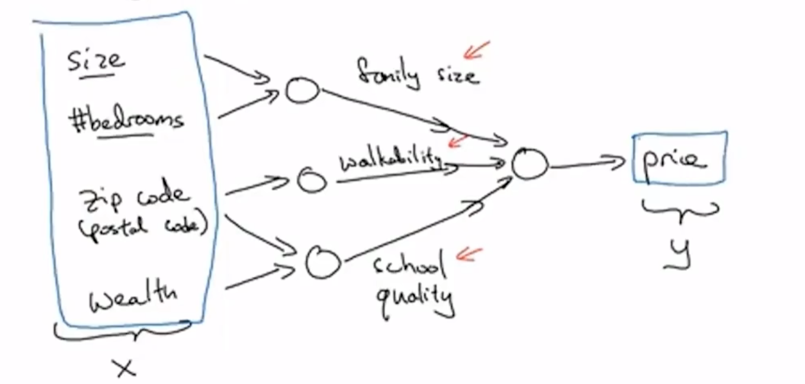

在上面的这个例子当中，size、bedrooms、zip code、wealth等入参都做x，后面对应的是多个ReLU function，最终以price的形式输出。在实际的神经网络中，中间的部分(hidden unit)都是自主计算的，只需要输入x即可得出y。

同时我们不会和神经网络去说明，hidden layer中每个neuron到底是什么，不像我们上图说到的family size是由size、bedroom来决定的，真实情况是这里由神经网络通过所有的入参来自行决定。

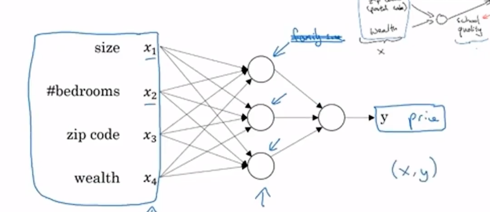

### 1.2 Supervised Learning with Neural Networks

Different type of Supervised Learning in different industries.

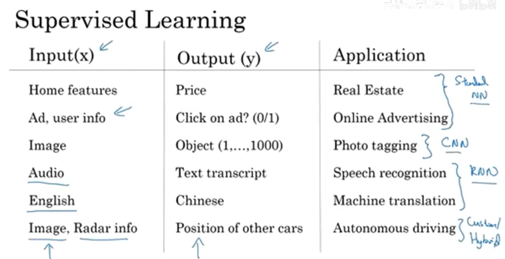

1. 房地产、广告：标准NN
2. 图像：CNN
3. 语音、翻译：1-dimension sequence data -> RNN
4. 自动驾驶：Customer hybird NN

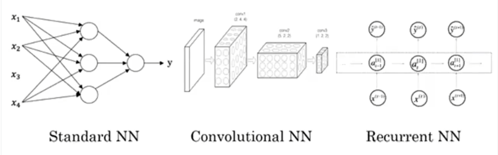

结构化数据和非结构化数据：

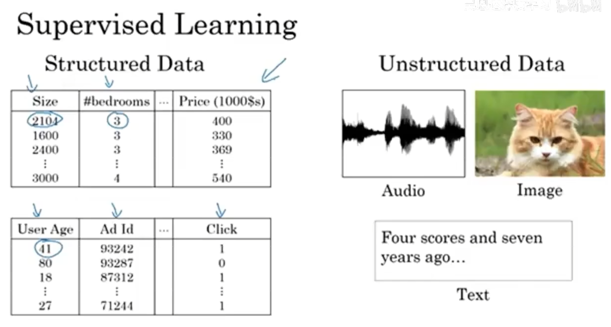

### 2.1 Binary Classification

用RGB矩阵的形态，来表示一张图片，这张图片将会被分为1或0.

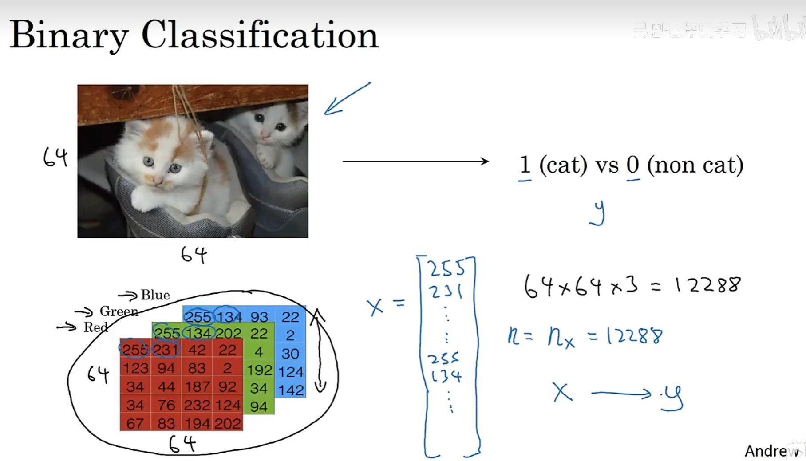

训练集中数据和结果的呈现方式。

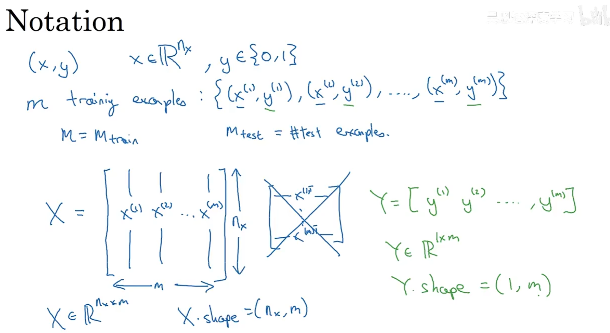

#### 2.2 Logistic Regression

sigmoid函数：通过sigmoid函数的框定，将一个线性函数的输出值圈定在了0和1之间。

p.s. 如果x是一张猫猫图片，y则是这张图片有多大的概率是猫猫图片

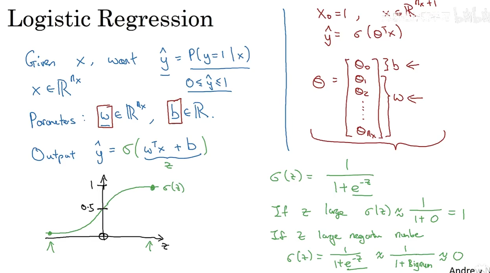

#### 2.3 Logistic Regression cost function

Loss(error) function:（单个训练结果）用来衡量y hat和实际的y到底由多接近  

Cost function:（整体训练结果）用来衡量w和b在整体training set上的结果

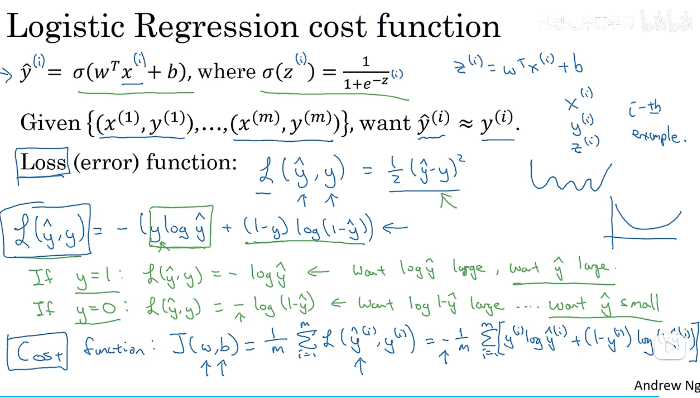

#### 2.4 Gradient Descent

Want to find w,b that minimize J(w,b) <- COST FUNCTION

https://www.cnblogs.com/shizyxya/p/16425947.html

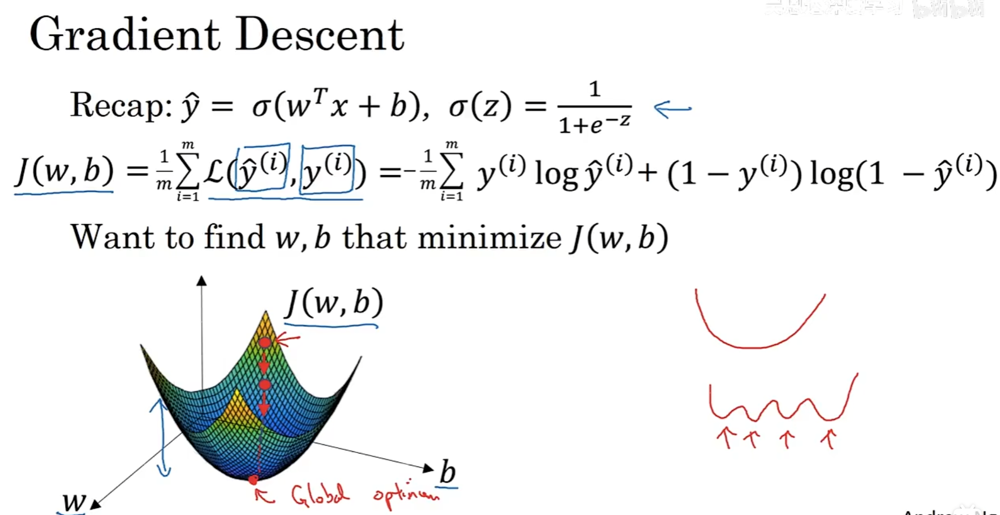

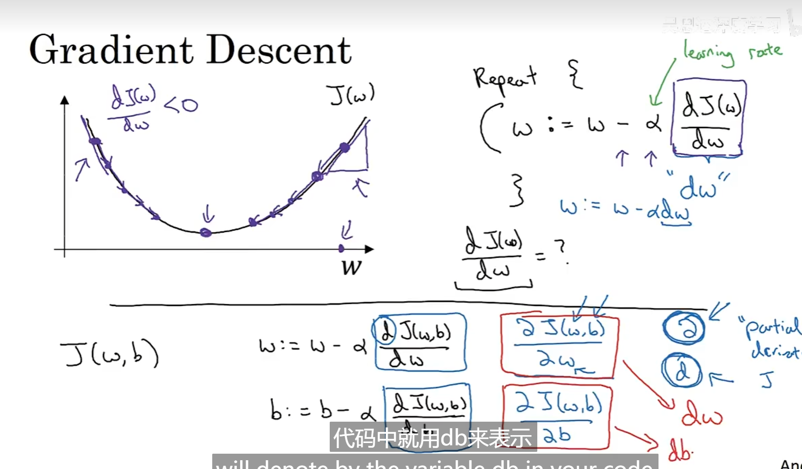

#### 2.5 Derivatives

  导数 = 斜率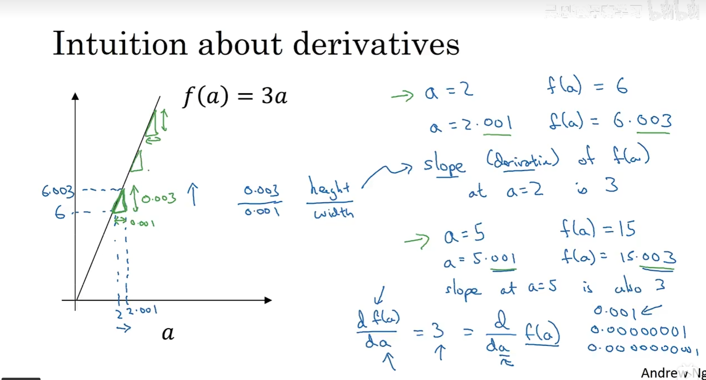

#### 2.6 More Derivatives Examples

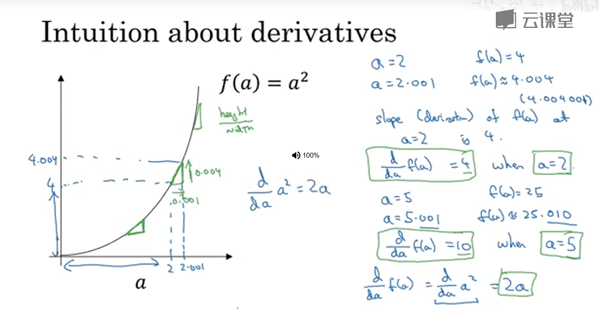

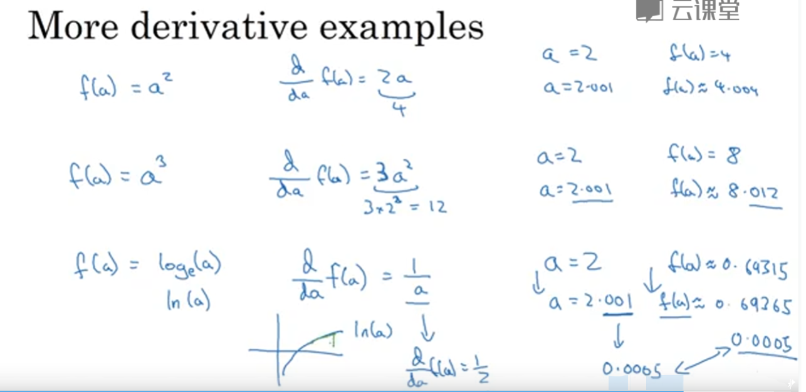

#### 2.7 Computation Graph？（流程图）

正向运算

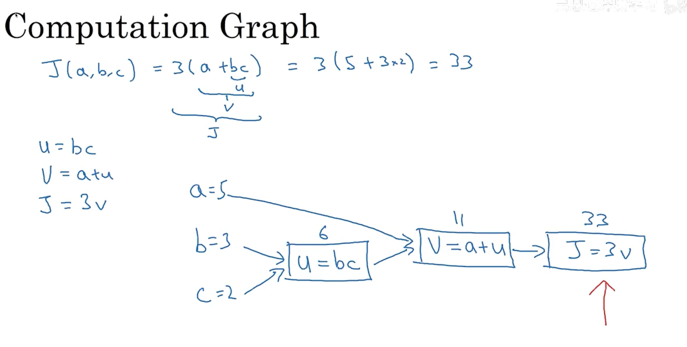

#### 2.8 Derivatives with a Computation Graph

流程图的求导 -> 反向运算

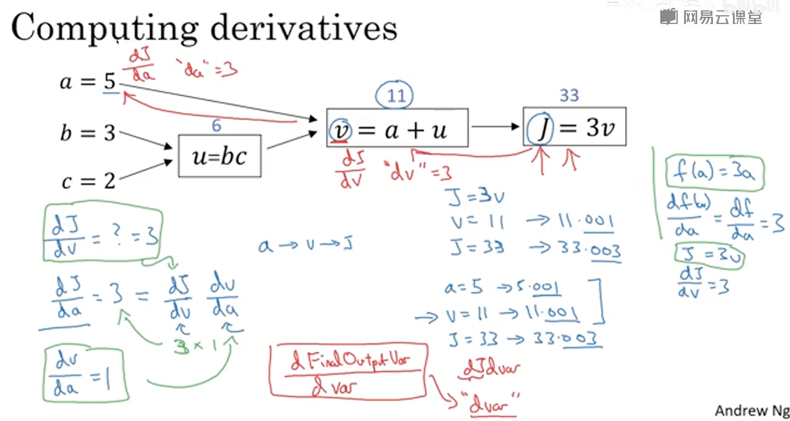

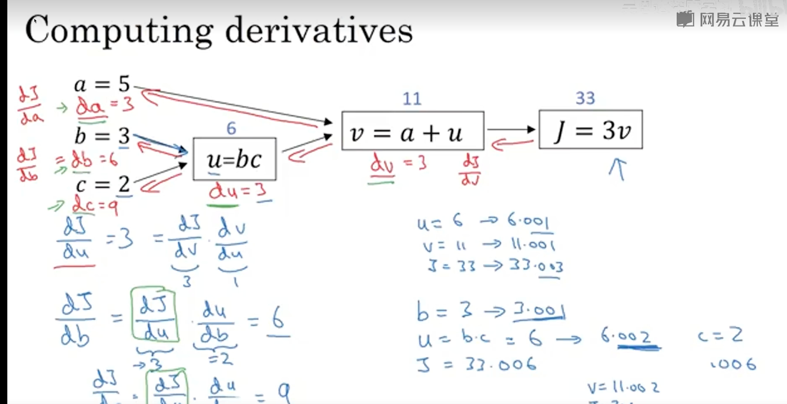